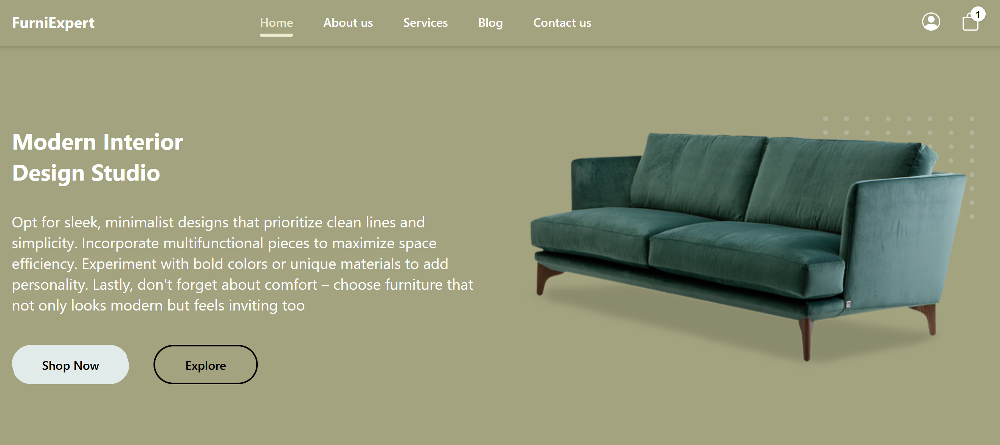

Nội dung bài học số 3:

<ul>
    <li>Gắn link menu tới từng trang</li>  
    <li>Tên trang giờ đã hiển thị trên tab của trình duyệt</li>
    <li>Có hỗ trợ chức năng SEO bằng cách thêm thẻ meta mô tả trang</li>
    <li>Sử dụng TailwindCSS 4.x (TailwindCSS có tốc độ cải thiện tốt, nhấn mạnh CSS-first)</li>
    <li>Trong đó sử dụng index.css (khai báo biến truyền thống var(--))</li>
    <li>Có thử nghiệm thư viện/gói react-helmet-async nhưng không có kết quả</li>
    <li>Sử dụng code trực tiếp để thêm thẻ meta</li>
</ul>   